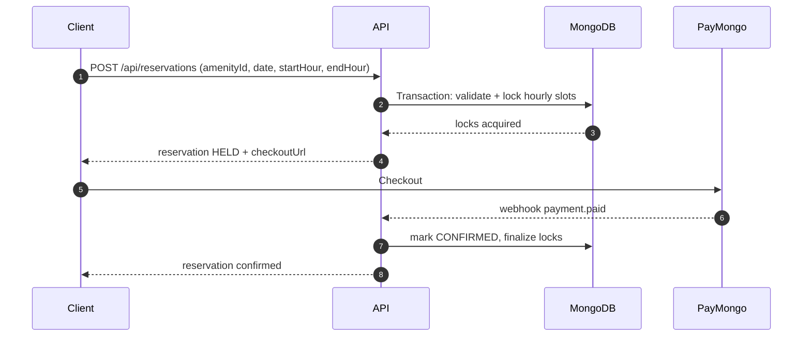
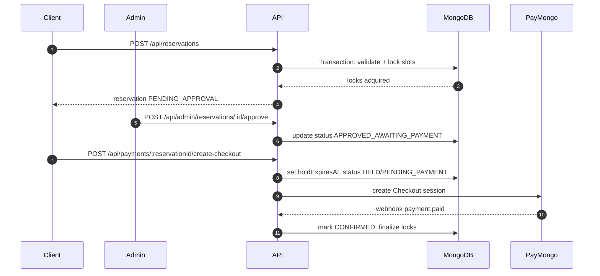

# Reservation Portal Architecture

## Overview
The system is split into a Nuxt 3 SSR frontend and a Node.js + Express API with MongoDB. All time-based logic uses `Asia/Manila`.

## Booking Sequence Diagrams

### Short Booking (1–2 hours, auto-approve)

### Long Booking (>= 3 hours or whole-day)

## MongoDB Slot Locking Strategy
- Each hour is a Slot document: `{ amenityId, date, hourStart, lockedByReservationId, lockStatus, expiresAt }`.
- Unique compound index on `(amenityId, date, hourStart)` ensures a single slot per hour.
- Reservations acquire locks in a transaction; conflicts abort the transaction.
- On EXPIRED/DENIED/CANCELLED, release locks.

## Reservation State Machine
Statuses: `HELD`, `PENDING_PAYMENT`, `PENDING_APPROVAL`, `APPROVED_AWAITING_PAYMENT`, `CONFIRMED`, `DENIED`, `EXPIRED`, `CANCELLED`, `COMPLETED`.

## Acceptance Tests Mapping
- Booking windows are validated by start date and time (daytime vs evening).
- One active booking enforced by checking active statuses for the user.
- Slot locking transaction prevents double booking.
- Webhook idempotency handled by storing processed event IDs.

## Deployment Requirements
- HTTPS required for PayMongo webhooks.
- Environment variables for PayMongo, OAuth, and OTP providers.
